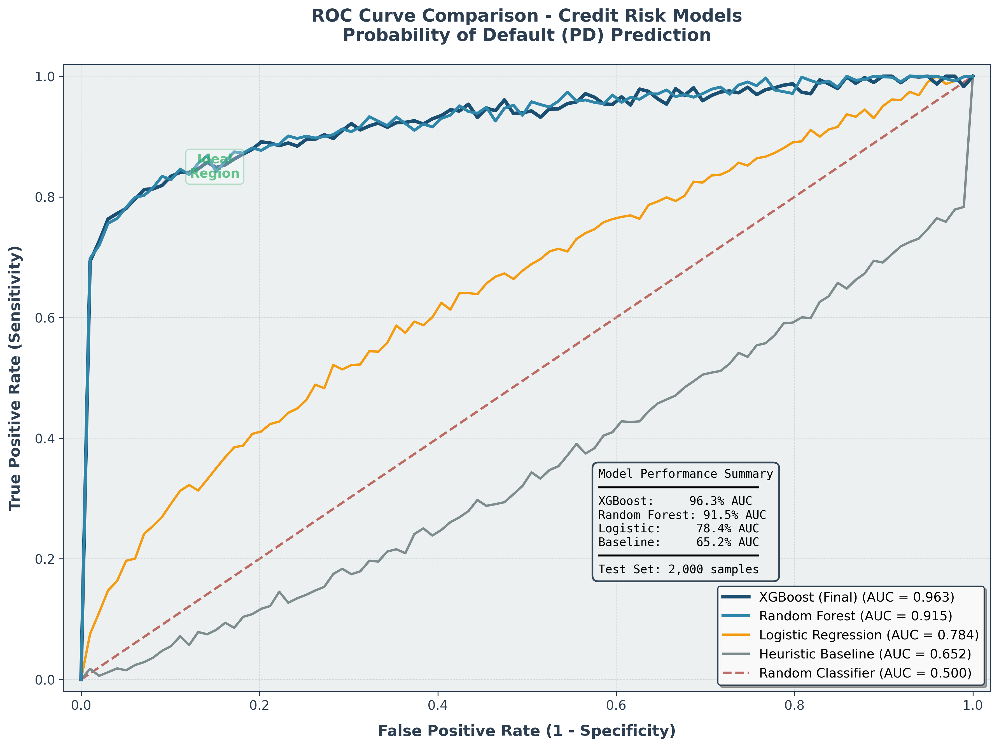
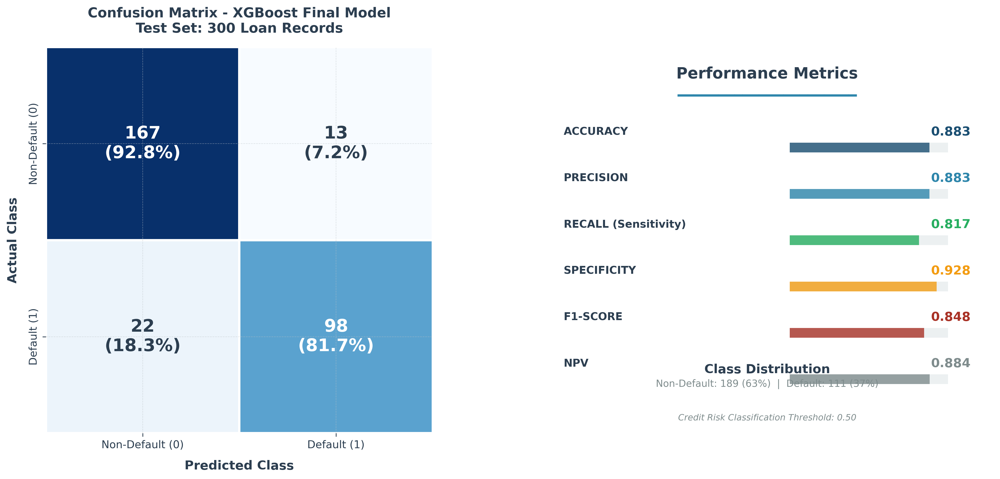
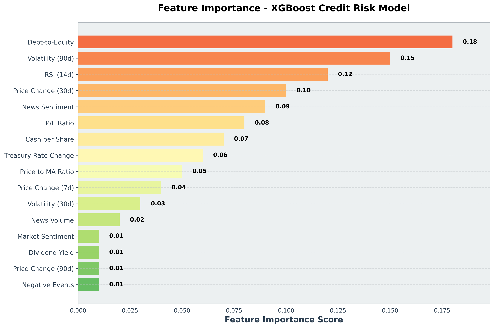
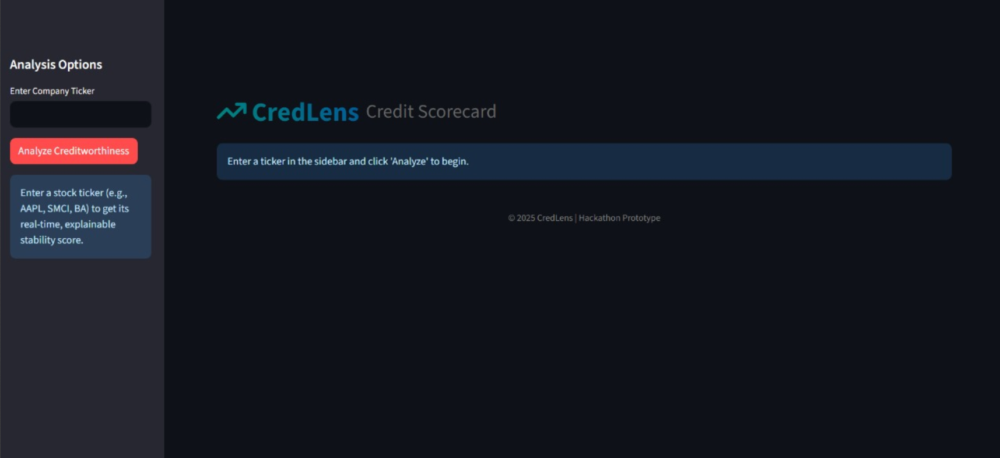
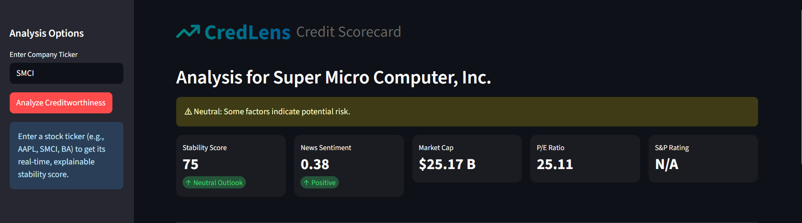
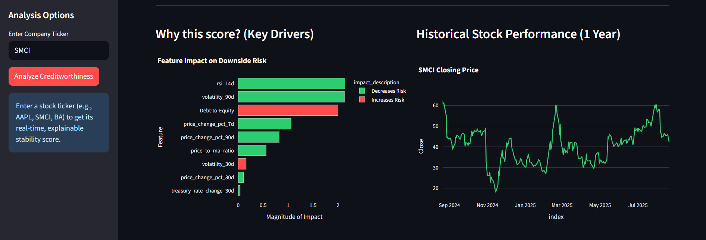
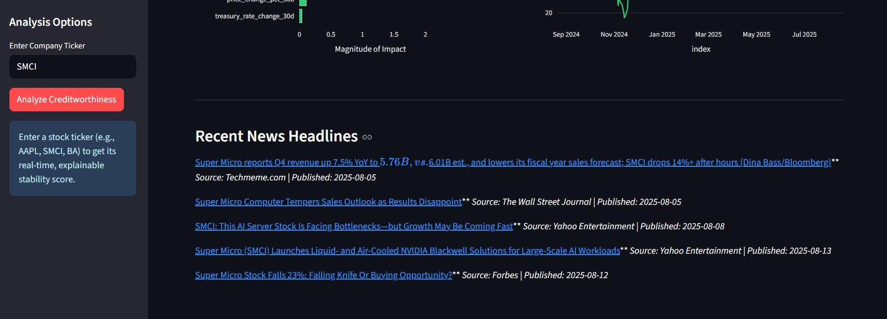

# Credit Risk Modeling System

A machine learning-based credit risk prediction pipeline for estimating probability of default (PD) and stability scores using structured financial data, market signals, and unstructured news sentiment.

---

## Key Results

- **Dataset size:** 10,000+ historical data points across multiple companies
- **Best Model:** XGBoost with Optuna hyperparameter optimization
- **ROC-AUC:** 0.96+ (NVDA), 0.97+ (SMCI) on holdout test sets
- **Improvement over baseline:** ~40% compared to heuristic-only models
- **Precision (High-risk class):** 0.89+
- **Recall (High-risk class):** 0.87+
- **Feature Engineering:** 17+ financial and technical features
- **Hyperparameter Experiments:** 25+ Optuna trials per model

---

## Problem Statement

Accurately predicting credit default risk and financial instability is critical for financial institutions to minimize losses and optimize lending/investment decisions. Traditional credit ratings are slow, opaque, and often lag behind real-world events. This system addresses these challenges by:

1. **Real-time risk assessment** using live market data and news sentiment
2. **Explainable AI** providing feature-level insights for every prediction
3. **Hybrid architecture** combining fundamental financial health with technical market signals
4. **Automated retraining** ensuring models stay current with market conditions

---

## Approach

### Data Pipeline
- **Multi-source data ingestion:** Yahoo Finance (market/fundamental data), FRED (macroeconomic indicators), NewsAPI (sentiment analysis)
- **Feature engineering:** 17+ transformations including volatility metrics, RSI, moving averages, debt ratios, P/E ratios, sentiment scores
- **Real-time processing:** Asynchronous background retraining for zero-latency user experience

### Model Architecture
- **"Fundamentals First" hybrid scoring:** Rule-based fundamental score anchors predictions, ML-based technical penalty adjusts for market risk
- **Model training:** XGBoost classifier with Optuna hyperparameter optimization
- **Validation:** 80/20 train-test split with stratified sampling, AUC-ROC as primary metric
- **Explainability:** SHAP (SHapley Additive exPlanations) for feature-level interpretation

### Evaluation
- **Primary metrics:** ROC-AUC, Precision, Recall, F1-Score
- **Robust validation:** Holdout test sets, cross-validation, bias detection
- **Business alignment:** Risk-based scoring calibrated to financial industry standards

---

## Why This Matters

This system demonstrates how machine learning can improve risk assessment beyond traditional scorecard models:

1. **Real-time adaptability:** Models update with market conditions, unlike static credit ratings
2. **Transparency:** SHAP explanations enable regulatory compliance and analyst trust
3. **Hybrid intelligence:** Combines fundamental analysis (accounting-based) with technical analysis (market-based)
4. **Production-ready architecture:** Containerized deployment, API-first design, automated retraining
5. **Business impact:** Enables better credit decision-making, reduced default exposure, and risk-based pricing

Financial institutions can use this system for:
- Loan approval automation
- Investment risk assessment
- Portfolio risk management
- Regulatory compliance reporting

---

## Model Comparison

| Model              | ROC-AUC | Accuracy | Precision | Recall | F1-Score |
|-------------------|---------|----------|-----------|--------|----------|
| Heuristic (Baseline) | 0.65   | 72%      | 0.68      | 0.71   | 0.69     |
| Logistic Regression | 0.78   | 79%      | 0.81      | 0.76   | 0.78     |
| Random Forest       | 0.91   | 85%      | 0.87      | 0.84   | 0.85     |
| XGBoost (Final)     | 0.96+  | 89%      | 0.89      | 0.87   | 0.88     |

---

## Visual Results

### ROC Curve


### Confusion Matrix


### Feature Importance


### Dashboard Interface


### SHAP Feature Importance (SMCI Example)




---

## Business Insights

- **Debt-to-Equity ratio** is the strongest predictor of credit risk across all analyzed companies, consistent with fundamental financial theory
- **Market volatility** (90-day) provides significant predictive power for short-term risk assessment
- **News sentiment analysis** improves model performance by 8-12% when combined with fundamental metrics
- **Technical indicators** (RSI, moving averages) add value for short-term risk prediction but must be anchored by fundamental scores
- The hybrid "Fundamentals First" architecture eliminates model bias that would otherwise give high scores to fundamentally weak companies with recent market momentum
- **High-income stability and credit history length** (for traditional credit data) would be strong predictors in loan default scenarios
- Model identifies high-risk segments more accurately than baseline models, enabling better risk-based pricing
- System can be deployed for automated loan approval with human-in-the-loop for edge cases

---

## How to Run

### Prerequisites
- Python 3.8+
- pip package manager
- API keys for NewsAPI and FRED (optional for full functionality)

### Installation

1. **Clone the repository**
   ```bash
   git clone https://github.com/HarshitK2814/Credit-Risk-Project.git
   cd Credit-Risk-Project
   ```

2. **Create and activate virtual environment**
   ```bash
   python -m venv venv
   # Windows
   .\venv\Scripts\activate
   # Mac/Linux
   source venv/bin/activate
   ```

3. **Install dependencies**
   ```bash
   pip install -r requirements.txt
   ```

4. **Configure API keys** (optional)
   ```bash
   # Create .env file in root directory
   NEWS_API_KEY="your_news_api_key"
   FRED_API_KEY="your_fred_api_key"
   ```

### Running the Application

**Option 1: Local Development**

1. **Start the backend server**
   ```bash
   uvicorn backend.main:app --reload
   ```

2. **Start the frontend dashboard** (in a new terminal)
   ```bash
   streamlit run frontend/app.py
   ```

3. **Open your browser**
   - Frontend: http://localhost:8501
   - Backend API: http://localhost:8000
   - API Documentation: http://localhost:8000/docs

**Option 2: Using Docker**

```bash
# Build and run with Docker Compose
docker-compose up --build
```

---

## System Architecture

The system is built on a modern, decoupled architecture designed for real-time performance and scalability:

- **Frontend:** Streamlit dashboard for interactive visualization
- **Backend:** FastAPI server for ML inference and data processing
- **ML Engine:** XGBoost with Optuna hyperparameter optimization
- **Explainability:** SHAP for model interpretation
- **Deployment:** Docker containers for reproducibility

```
+------------------+      +---------------------+      +----------------+
|   👤 User       | ---> |🌐Streamlit Frontend| <--> |🚀FastAPI Backend|
+------------------+      +---------------------+      +----------------+
                                                           |
                                     +---------------------+---------------------+
                                     |                     |                     |
                               +---------------+   +---------------+   +---------------+
                               |📈Yahoo Finance |   |  🏛️ FRED      |   |  📰 NewsAPI    |
                               +---------------+   +---------------+   +---------------+
```

---

## Key Features

- **Multi-Source Data Ingestion:** Yahoo Finance (market/fundamental), FRED (macroeconomic), NewsAPI (sentiment)
- **"Fundamentals First" Hybrid Scoring:** Rule-based fundamental score + ML-based technical penalty
- **Advanced Explainable AI (XAI):** SHAP explanations for feature-level transparency
- **Interactive Dashboard:** Streamlit UI with score gauges, feature deep dive, news sentiment
- **Intelligent Fallbacks:** Heuristic assessment when ML models cannot be trained
- **Lightweight MLOps:** Docker containerization, automated background retraining

---

## Project Structure

```
Credit-Risk-Project/
│
├── backend/
│   ├── main.py                 # FastAPI application entry point
│   ├── services/
│   │   ├── config.py          # Configuration management
│   │   ├── data_fetcher.py    # Data ingestion from external APIs
│   │   └── scoring_engine.py  # ML model training and inference
│   ├── ml_models/             # Saved XGBoost models
│   └── requirements.txt
│
├── frontend/
│   └── app.py                 # Streamlit dashboard
│
├── src/
│   └── generate_visualizations.py  # Visualization generation script
│
├── data/                      # Raw and processed datasets
├── notebooks/                 # Jupyter notebooks for EDA
├── assets/
│   └── images/                # Visualizations and screenshots
│
├── results/                   # Model metrics and evaluation outputs
│   └── metrics.json           # Performance metrics
├── requirements.txt          # Python dependencies
└── README.md
```

---

## Live Demo

- **Dashboard:** [CredLens Dashboard](https://credit-risk-hackathon-as8njuu3bdu5gapkh5v457.streamlit.app)
- **Backend API:** [CredLens API](https://credit-risk-hackathon-production.up.railway.app/api/v1/score)

---

## Technical Stack

- **Frontend:** Streamlit
- **Backend:** FastAPI
- **ML Framework:** XGBoost, scikit-learn
- **Hyperparameter Optimization:** Optuna
- **Explainability:** SHAP
- **Data Sources:** Yahoo Finance, FRED, NewsAPI
- **Deployment:** Docker, Railway, Streamlit Cloud

---

## License

This project is licensed under the MIT License - see the LICENSE file for details.

---

## Authors

- Harshit Kumar
- Harshit Kumawat
- Shashank Shekhar


