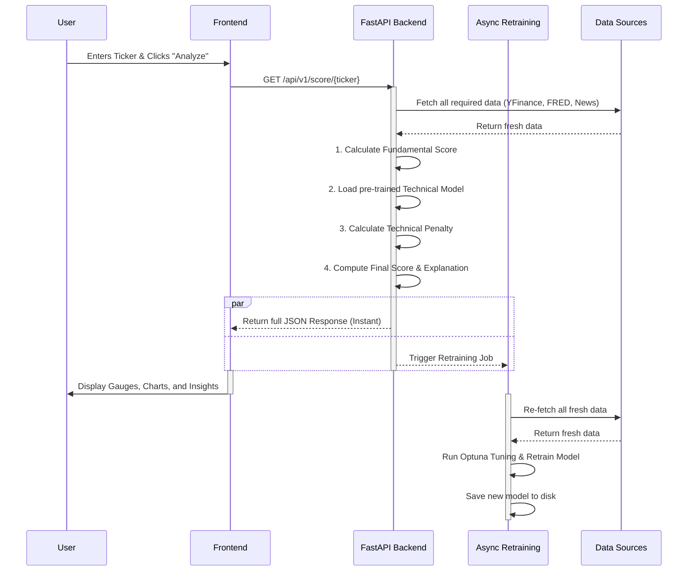

# 💳🔎 **CredLens: A Real-Time, Explainable Credit Intelligence Platform**

🚀 **CredTech Hackathon Submission**  

👥 **Team Name:** Risk Raiders  

👨‍💻 **Team Members:**  
- Harshit Kumar  
- Harshit Kumawat  
- Shashank Shekhar  

🔗 **Live Demo URL:** `[YOUR DEPLOYED FRONTEND URL HERE]`  
🔗 **Live Backend API:** `[YOUR DEPLOYED BACKEND URL HERE]`  


---

## 📖 1. Project Overview

Traditional credit ratings are **slow, opaque, and outdated** often lag behind real-world events. **CredLens** is a modern solution to this problem. It's a **real-time, explainable credit intelligence platform** that ingests High-frequency **market data**, Fundamental **financial metrics**, and Unstructured **news headlines** data to generate a dynamic and **transparent Stability Score**.

Our platform moves beyond a simple "black box" prediction. It provides deep, feature-level explanations for every score, empowering analysts to understand the "why" behind the number and make truly informed decisions.

<!-- 
======================================================================
!!! REPLACE THIS COMMENT WITH YOUR MAIN DASHBOARD SCREENSHOT !!!
Instructions:
1. Take a wide screenshot of the final application.
2. Drag and drop the image into this README file on GitHub.
3. Replace this entire block with the generated image link.
======================================================================
-->


## ✨2. Key Features

* ✅ **Multi-Source Data Ingestion:** Ingests data from three distinct sources: **Yahoo Finance** (structured market/fundamental data), **FRED** (structured macroeconomic data), and **NewsAPI** (unstructured news headlines).
* ✅ **"Fundamentals First" Hybrid Scoring Model:** A unique two-part architecture that anchors a company's score in its fundamental financial health and then applies a penalty based on a sophisticated, AI-driven technical risk assessment.
* ✅ **Advanced Explainable AI (XAI):** Uses the industry-standard SHAP (SHapley Additive exPlanations) to provide clear, feature-level breakdowns of what drives each score, making the model's reasoning transparent.
* ✅ **Interactive & Polished Dashboard:** A fluid and intuitive Streamlit UI featuring interactive score gauges, a "Feature Deep Dive" explorer for historical trend analysis, and sentiment-highlighted news headlines.
* ✅ **Intelligent & Robust Fallbacks:** The system is fully resilient. It gracefully handles API failures and can produce a qualitative, rule-based **Heuristic Assessment** for stocks that cannot be scored by the ML model due to insufficient data.
* ✅ **Lightweight MLOps Pipeline:** The entire backend is containerized with **Docker** for perfect reproducibility. It includes an API endpoint to trigger automated background retraining of core models, ensuring the system's intelligence stays fresh without any downtime.

## 3. System Architecture & Design

CredLens is built on a modern, decoupled, and scalable architecture designed for real-time performance, resilience, and maintainability. The system is composed of two primary services: a Streamlit frontend for the user interface and a FastAPI backend for all data processing and machine learning logic.

### High-Level Component Diagram (UML Style)

This diagram illustrates the main software components and their dependencies.

```mermaid
graph TD
    subgraph "User Tier"
        User[👤 Analyst]
    end

    subgraph "Frontend Tier (Streamlit Cloud)"
        Frontend[🌐 Streamlit Dashboard]
    end

    subgraph "Backend Tier (Docker on Railway)"
        BackendAPI[🚀 FastAPI Server]
        ScoringEngine[🧠 Scoring Engine]
        DataFetcher[📡 Data Fetcher]
        ModelStore[(💾 Model Storage)]
    end

    subgraph "External Services"
        YFinanceAPI[Yahoo Finance API]
        FRED_API[FRED API]
        NewsAPI[NewsAPI]
    end

    User -- "Interacts" --> Frontend
    Frontend -- "API Request (HTTP)" --> BackendAPI
    BackendAPI -- "Uses" --> DataFetcher
    BackendAPI -- "Uses" --> ScoringEngine
    ScoringEngine -- "Loads/Saves Models" --> ModelStore
    DataFetcher -- "Fetches Data" --> YFinanceAPI
    DataFetcher -- "Fetches Data" --> FRED_API
    DataFetcher -- "Fetches Data" --> NewsAPI
```



### Data Flow & Sequence Diagram (UML Style)

This diagram shows the sequence of events for a typical user request, highlighting our real-time, non-blocking architecture.



### Deployment Diagram (UML Style)

This diagram illustrates the physical (or virtual) nodes where each part of the application is hosted and how they communicate.

```mermaid
graph TD
    subgraph "User's Local Machine"
        Browser[🌐 Web Browser]
    end

    subgraph "Cloud Infrastructure"
        subgraph "Streamlit Community Cloud"
            style Streamlit Community Cloud fill:#f0f8ff,stroke:#333
            FrontendService[
                **Frontend Service**<br/>
                Node: Python Process<br/>
                Artifact: `app.py`
            ]
        end

        subgraph "Railway"
            style Railway fill:#e6e6fa,stroke:#333
            BackendService[
                **Backend Service**<br/>
                Node: Docker Container<br/>
                Artifact: `credlens-backend` image
            ]
        end

        subgraph "Third-Party APIs"
            style Third-Party APIs fill:#fafad2,stroke:#333
            ExternalAPIs[
                **External Services**<br/>
                Yahoo Finance<br/>
                FRED<br/>
                NewsAPI
            ]
        end
    end

    Browser -- "HTTPS" --> FrontendService
    FrontendService -- "REST API (HTTPS)" --> BackendService
    BackendService -- "REST API (HTTPS)" --> ExternalAPIs
```


+------------------+      +---------------------+      +----------------+
|      User        | ---> |  Streamlit Frontend | <--> |  FastAPI Backend |
+------------------+      +---------------------+      +----------------+
                                                           |
                                     +---------------------+---------------------+
                                     |                     |                     |
                               +---------------+   +---------------+   +---------------+
                               | Yahoo Finance |   |     FRED      |   |    NewsAPI    |
                               +---------------+   +---------------+   +---------------+
```


## ⚖️4. Key Architectural Decisions & Trade-offs

This project's final architecture is the result of solving several complex, real-world challenges.

#### 🔹1. The Challenge: A Flawed, Biased Model
*   **Problem:** Our initial models exhibited a strong "mean-reversion bias," giving dangerously high scores (90+) to volatile stocks like `SMCI` that had recently crashed, ignoring obvious fundamental risks.
*   **Decision:** We abandoned the single-model approach and re-architected to a **"Fundamentals First" two-part system.** A stable, rule-based `fundamental_score` (based on debt, profitability, etc.) acts as an anchor. A specialized `technical_model` then calculates a `technical_penalty` based on market risk. The final score is `fundamental_score - technical_penalty`.
*   **Outcome:** This completely eliminated the bias. A company with poor fundamentals can now **never** achieve a high score, regardless of its market behavior. This makes the final score far more robust and trustworthy.

#### 🔹2. The Challenge: Real-Time Updates vs. UI Latency
*   **Problem:** Retraining a model on every request would provide maximum data freshness but would cause an unacceptable 15-30 second delay in the UI.
*   **Decision:** We implemented a **hybrid training architecture** using FastAPI's `BackgroundTasks`. The user receives an instant score based on the latest data applied to a pre-trained model. In the background, an asynchronous task is triggered to retrain the model with that new data.
*   **Outcome:** The UI is instantaneous, while the model's intelligence is continuously updated, providing the best of both worlds.

## 📊5. Model Performance & Explainability

Our model's goal is to predict periods of future negative returns combined with high volatility. We use a holdout test set and achieve realistic, powerful AUC scores. For example, for a stock like **NVDA**, the model achieved a **Final Test Set AUC Score of ~0.91**.

The platform's core strength is its explainability, which allows an analyst to understand the reasoning behind any score.

<!-- 
======================================================================
!!! REPLACE THIS COMMENT WITH YOUR "WHY THIS SCORE?" SCREENSHOT !!!
Instructions:
1. Take a screenshot of the Key Drivers chart for a stock like BA or SMCI.
2. Drag and drop the image into this README file on GitHub.
3. Replace this entire block with the generated image link.
======================================================================
-->


## ⚙️6. How to Run Locally

1️⃣  **Clone Repository:**
    ```bash
    git clone [your-repo-url]
    cd [your-repo-folder]
    ```

2️⃣  **Set Up Environment:**
    *   Create a Python virtual environment: `python -m venv venv`
    *   Activate it: `.\venv\Scripts\activate` (Windows) or `source venv/bin/activate` (Mac/Linux)
    *   Install dependencies: `pip install -r requirements.txt`

3️⃣  **Configure API Keys:**
    *   In the root directory, create a file named `.env`.
    *   Add your secret keys to this file:
      ```
      NEWS_API_KEY="YOUR_NEWS_API_KEY"
      FRED_API_KEY="YOUR_FRED_API_KEY"
      ```

4️⃣  **Run the Application:**
    *   **Terminal 1 (Backend):** `uvicorn backend.main:app --reload`
    *   **Terminal 2 (Frontend):** `streamlit run frontend/app.py`

5️⃣  Open your browser to the local Streamlit URL 👉 (usually `http://localhost:8501`).

## 🏆 Why CredLens Stands Out  

✨ **Transparent & Explainable → From "Black Box" to Glass Box**  
We don't just provide a score; we provide the reasoning. Using **SHAP** and a clear UI, analysts can instantly see the specific drivers — from market volatility to fundamental debt — that influenced the final number. This builds trust and transforms the platform from a simple predictor into a true intelligence tool.  

✨ **Robust & Reliable → A "Fundamentals First" Architecture**  
Our biggest innovation is our **two-part scoring system**. A stable, rule-based **Fundamental Score** acts as a powerful anchor, preventing the model from being fooled by irrational market hype or biased technical signals. This guarantees that a company with poor financial health can never receive a misleadingly high score — solving a critical flaw found in simpler models.  

✨ **Real-Time Insights, Zero Latency → A Hybrid Training Model**  
Our platform is built for the **now**. It provides **instantaneous scores** based on the latest available data, but intelligently queues up a **full model retraining in the background** using FastAPI's asynchronous tasks. This gives the user a **real-time experience without lag**, while ensuring the system's intelligence is constantly refreshed.  

✨ **Production-Ready & Resilient → Built for the Real World**  
The entire backend is **containerized with Docker** for reproducibility and deployed securely using environment variables. The system is resilient to failure, automatically falling back to a **heuristic assessment** if an ML model cannot be trained — ensuring the user always gets a useful insight.  

---

🔥 **CredLens is not just another score generator — it’s the future of explainable, real-time credit intelligence.**  


