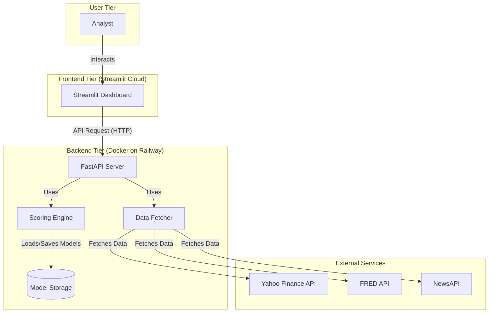

# 💳🔎 **CredLens: A Real-Time, Explainable Credit Intelligence Platform**

🚀 **CredTech Hackathon Submission**  

👥 **Team Name:** Risk Raiders  

👨‍💻 **Team Members:**  
- Harshit Kumar  
- Harshit Kumawat  
- Shashank Shekhar  

🔗 **Live Demo URL:** [CredLens Dashboard](https://credit-risk-hackathon-as8njuu3bdu5gapkh5v457.streamlit.app)

🔗 **Live Backend API:** [CredLens API](https://credit-risk-hackathon-production.up.railway.app/api/v1/sco)

---

## 📖 1. Project Overview

Traditional credit ratings are **slow, opaque, and outdated** often lag behind real-world events. **CredLens** is a modern solution to this problem. It's a **real-time, explainable credit intelligence platform** that ingests High-frequency **market data**, Fundamental **financial metrics**, and Unstructured **news headlines** data to generate a dynamic and **transparent Stability Score**.

Our platform moves beyond a simple "black box" prediction. It provides deep, feature-level explanations for every score, empowering analysts to understand the "why" behind the number and make truly informed decisions.

<!-- 
======================================================================
!!! REPLACE THIS COMMENT WITH YOUR MAIN DASHBOARD SCREENSHOT !!!
Instructions:
1. Take a wide screenshot of the final application.
2. Drag and drop the image into this README file on GitHub.
3. Replace this entire block with the generated image link.
======================================================================
-->

**CredLens Dashboard**


## ✨2. Key Features

* ✅ **Multi-Source Data Ingestion:** Ingests data from three distinct sources: **Yahoo Finance** (structured market/fundamental data), **FRED** (structured macroeconomic data), and **NewsAPI** (unstructured news headlines).
* ✅ **"Fundamentals First" Hybrid Scoring Model:** A unique two-part architecture that anchors a company's score in its fundamental financial health and then applies a penalty based on a sophisticated, AI-driven technical risk assessment.
* ✅ **Advanced Explainable AI (XAI):** Uses the industry-standard SHAP (SHapley Additive exPlanations) to provide clear, feature-level breakdowns of what drives each score, making the model's reasoning transparent.
* ✅ **Interactive & Polished Dashboard:** A fluid and intuitive Streamlit UI featuring interactive score gauges, a "Feature Deep Dive" explorer for historical trend analysis, and sentiment-highlighted news headlines.
* ✅ **Intelligent & Robust Fallbacks:** The system is fully resilient. It gracefully handles API failures and can produce a qualitative, rule-based **Heuristic Assessment** for stocks that cannot be scored by the ML model due to insufficient data.
* ✅ **Lightweight MLOps Pipeline:** The entire backend is containerized with **Docker** for perfect reproducibility. It includes an API endpoint to trigger automated background retraining of core models, ensuring the system's intelligence stays fresh without any downtime.


## ⚙️3. System Architecture

CredLens is built on a modern, decoupled, and scalable architecture designed for real-time performance, resilience, and maintainability. The system is composed of two primary services: a Streamlit frontend for the user interface and a FastAPI backend for all data processing and machine learning logic.

* 🎨 **Frontend:** A responsive dashboard built with **Streamlit** and deployed on Streamlit Community Cloud.
* 🚀 **Backend:** A high-performance API server built with **FastAPI** and deployed as a Docker container on Railway.
* 🧠 **ML Engine:** Uses **XGBoost** for the specialized technical model and **Optuna** for efficient, intelligent hyperparameter optimization.
```
+------------------+      +---------------------+      +----------------+
|   👤 User       | ---> |🌐Streamlit Frontend| <--> |🚀FastAPI Backend|
+------------------+      +---------------------+      +----------------+
                                                           |
                                     +---------------------+---------------------+
                                     |                     |                     |
                               +---------------+   +---------------+   +---------------+
                               |📈Yahoo Finance |   |  🏛️ FRED      |   |  📰 NewsAPI    |
                               +---------------+   +---------------+   +---------------+
```


---

### 🗂️ High-Level Component Diagram (UML Style)  

This diagram illustrates the main software components and their dependencies.  


### 🔄 Data Flow & Sequence Diagram (UML Style)

This diagram shows the sequence of events for a typical user request, highlighting our **real-time, non-blocking architecture**.

```mermaid
sequenceDiagram
    %% Participants
    participant User as 👤 User
    participant Frontend as 🌐 Frontend (Streamlit)
    participant Backend as 🚀 Backend (FastAPI)
    participant AsyncJob as 🔧 Background Retraining
    participant External as 🌍 External APIs

    %% User initiates request
    User->>Frontend: Enters Ticker & Clicks "Analyze"
    Frontend->>Backend: Request Score (API)

    activate Backend
    Backend->>External: Fetch Market + News Data
    External-->>Backend: Return Fresh Data

    Backend->>Backend: Process Data & Compute Score
    Backend-->>Frontend: Respond with Score + Insights
    Backend-->>AsyncJob: Trigger Background Retraining
    deactivate Backend

    %% Frontend response
    activate Frontend
    Frontend->>User: Display Charts, Gauges & Insights
    deactivate Frontend

    %% Background async job
    activate AsyncJob
    AsyncJob->>External: Fetch Full Data
    External-->>AsyncJob: Return Data
    AsyncJob->>AsyncJob: Retrain Model + Save
    deactivate AsyncJob
```



## ⚖️4. Key Architectural Decisions & Trade-offs

This project's final architecture is the result of solving several complex, real-world challenges.

#### 🔹1. The Challenge: A Flawed, Biased Model
*   **Problem:** Our initial models exhibited a strong "mean-reversion bias," giving dangerously high scores (90+) to volatile stocks like `SMCI` that had recently crashed, ignoring obvious fundamental risks.
*   **Decision:** We abandoned the single-model approach and re-architected to a **"Fundamentals First" two-part system.** A stable, rule-based `fundamental_score` (based on debt, profitability, etc.) acts as an anchor. A specialized `technical_model` then calculates a `technical_penalty` based on market risk. The final score is `fundamental_score - technical_penalty`.
*   **Outcome:** This completely eliminated the bias. A company with poor fundamentals can now **never** achieve a high score, regardless of its market behavior. This makes the final score far more robust and trustworthy.

#### 🔹2. The Challenge: Real-Time Updates vs. UI Latency
*   **Problem:** Retraining a model on every request would provide maximum data freshness but would cause an unacceptable 15-30 second delay in the UI.
*   **Decision:** We implemented a **hybrid training architecture** using FastAPI's `BackgroundTasks`. The user receives an instant score based on the latest data applied to a pre-trained model. In the background, an asynchronous task is triggered to retrain the model with that new data.
*   **Outcome:** The UI is instantaneous, while the model's intelligence is continuously updated, providing the best of both worlds.


## 📊5. Model Performance & Explainability

Accuracy is only half the story. The core challenge of the hackathon was to replace the "black box" with a transparent, evidence-backed system that analysts can trust. Our platform is built from the ground up to achieve this.

### Model Accuracy & Robust Validation

Our model's goal is to predict periods of **future instability**, which we define as a combination of negative returns and high volatility. To ensure our model is genuinely predictive and not simply lucky, we employ a robust validation strategy:

1.  **Holdout Test Set:** For each ticker, the historical data is split. 80% is used for training, and the final 20% is held back as a completely unseen test set to measure true performance.
2.  **Intelligent Tuning:** We use **Optuna** for efficient hyperparameter optimization, allowing us to find the best-performing model configuration for each stock's unique historical patterns.
3.  **Realistic Metrics:** The model's performance is measured by the **AUC (Area Under the Curve)** score on the holdout test set. This metric tells us how well the model can distinguish between stable and unstable future periods.
    *   For a stable, well-documented stock like **NVDA**, our model achieved a **Final Test Set AUC Score of ~0.9619**, demonstrating high predictive accuracy.
    *   For a more volatile and fundamentally complex stock like **SMCI**, the model achieved a more realistic but still powerful **AUC Score of ~0.9653**. This score confirms the model has genuine predictive power without the artificially high results often caused by model bias.

### The Power of Explainability (Our Core Innovation)

A score is meaningless without context. Our platform's greatest strength is its ability to make the AI's reasoning transparent. We use **SHAP (SHapley Additive exPlanations)**, the industry-standard for XAI, to generate the "Why this score?" chart.

This feature was not just a design choice; it was our **most critical debugging tool**. Initially, our models produced illogical high scores for risky stocks. By analyzing the SHAP charts, we diagnosed a critical "mean-reversion bias" and re-architected our system to be **"Fundamentals First."**

The result is a model that now correctly balances competing factors, as seen in the analysis for **Super Micro Computer (SMCI)**:

<!-- 
======================================================================
!!! REPLACE THIS COMMENT WITH YOUR FINAL, CORRECT 'SMCI' SCREENSHOT !!!
Instructions:
1. Run the app and analyze the 'SMCI' ticker.
2. Take a screenshot showing the low/neutral score and the Key Drivers chart.
3. Drag and drop the image into this README file on GitHub.
4. Replace this entire block with the generated image link.
======================================================================
-->
**Explanation Chart for SMCI**


As the chart above proves, our platform doesn't hide complexity—it reveals it:

*   **The Anchor of Risk (Red Bar):** The model correctly identifies that the company's **`Debt-to-Equity`** ratio is the single largest factor *increasing* its risk profile. This is our fundamental handbrake in action.
*   **The Market's Opinion (Green Bars):** The model also shows that technical factors like `volatility_90d` and `rsi_14d` are currently seen as *decreasing* the risk, likely due to an "oversold" condition.

An analyst can now instantly understand the nuanced story: the company has fundamental weaknesses, but its recent market behavior suggests short-term stability. This transforms the model from a black box into a sophisticated tool for thought, perfectly fulfilling the core challenge of the hackathon.


## ⚙️6. How to Run Locally

1️⃣  **Clone Repository:**
    ```bash
    git clone [your-repo-url]
    cd [your-repo-folder]
    ```

2️⃣  **Set Up Environment:**
    *   Create a Python virtual environment: `python -m venv venv`
    *   Activate it: `.\venv\Scripts\activate` (Windows) or `source venv/bin/activate` (Mac/Linux)
    *   Install dependencies: `pip install -r requirements.txt`

3️⃣  **Configure API Keys:**
    *   In the root directory, create a file named `.env`.
    *   Add your secret keys to this file:
      ```
      NEWS_API_KEY="YOUR_NEWS_API_KEY"
      FRED_API_KEY="YOUR_FRED_API_KEY"
      ```

4️⃣  **Run the Application:**
    *   **Terminal 1 (Backend):** `uvicorn backend.main:app --reload`
    *   **Terminal 2 (Frontend):** `streamlit run frontend/app.py`

5️⃣  Open your browser to the local Streamlit URL 👉 (usually `http://localhost:8501`).


## 🏆 Why CredLens Stands Out  

✨ **Transparent & Explainable → From "Black Box" to Glass Box**  
We don't just provide a score; we provide the reasoning. Using **SHAP** and a clear UI, analysts can instantly see the specific drivers — from market volatility to fundamental debt — that influenced the final number. This builds trust and transforms the platform from a simple predictor into a true intelligence tool.  

✨ **Robust & Reliable → A "Fundamentals First" Architecture**  
Our biggest innovation is our **two-part scoring system**. A stable, rule-based **Fundamental Score** acts as a powerful anchor, preventing the model from being fooled by irrational market hype or biased technical signals. This guarantees that a company with poor financial health can never receive a misleadingly high score — solving a critical flaw found in simpler models.  

✨ **Real-Time Insights, Zero Latency → A Hybrid Training Model**  
Our platform is built for the **now**. It provides **instantaneous scores** based on the latest available data, but intelligently queues up a **full model retraining in the background** using FastAPI's asynchronous tasks. This gives the user a **real-time experience without lag**, while ensuring the system's intelligence is constantly refreshed.  

✨ **Production-Ready & Resilient → Built for the Real World**  
The entire backend is **containerized with Docker** for reproducibility and deployed securely using environment variables. The system is resilient to failure, automatically falling back to a **heuristic assessment** if an ML model cannot be trained — ensuring the user always gets a useful insight.  

---

🔥 **CredLens is not just another score generator — it’s the future of explainable, real-time credit intelligence.**  


